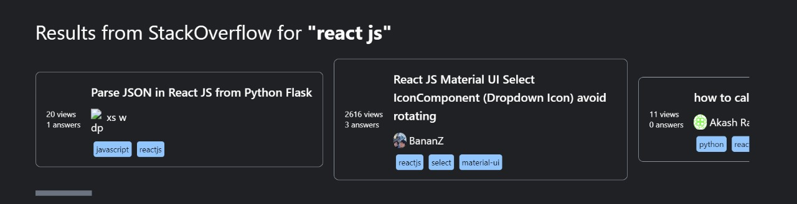
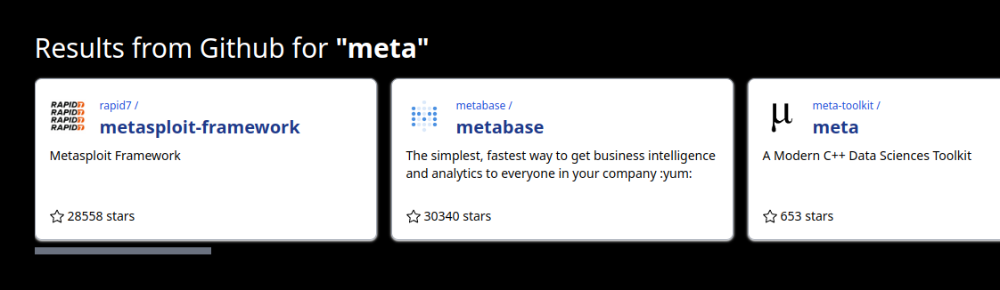

# _AppName_ ~ CodeCrunch 2022

## Table of contents

&emsp;[1. Team Details](#team-details)

&emsp;[2. Work Status](#work-status)

&emsp;[3. Getting Started](#getting-started)

&emsp;[4. Application User Interface](#application-user-interface)

## Team Details

-   Team Name: **_TheTriad_**
-   Team Members:

&emsp;&emsp;1. _Mohammed Afaan Sajjad Hussain Shaikh (afaan.shaikh.21@gmail.com)_

&emsp;&emsp;2. _Sai Sameer Kumar Lolla (saisameer.lolla@gmail.com)_

&emsp;&emsp;3. _Sajal Mandrekar (sajalmandrekar@gmail.com)_

## Work Status

-   Youtube: **Completed**
-   Stack overflow: **Completed**
-   Github: **Completed**
-   Twitter: **Completed**
-   Google: **Completed**

This is a [Next.js](https://nextjs.org/) project bootstrapped with [`create-next-app`](https://github.com/vercel/next.js/tree/canary/packages/create-next-app).

## Getting Started

&emsp;Install packages:

```
npm install     # install dependencies in package.json
```

&emsp;Run the development server:

```bash
npm run dev
# or
yarn dev
```

&emsp;Open [http://localhost:3000](http://localhost:3000) with your browser to see the result.

&emsp;You can start editing the page by modifying `pages/index.js`. The page auto-updates as you edit the file.

&emsp;[API routes](https://nextjs.org/docs/api-routes/introduction) can be accessed on [http://localhost:3000/api/hello](http://localhost:3000/api/hello). This endpoint can be edited in `pages/api/hello.js`.

&emsp;The `pages/api` directory is mapped to `/api/*`. Files in this directory are treated as [API routes](https://nextjs.org/docs/api-routes/introduction) instead of React pages.


## Application User Interface

###   **YouTube**

&emsp;&emsp;

###   **Google**

&emsp;&emsp;

###   **StackOverflow**

&emsp;&emsp;

###   **GitHub**

&emsp;&emsp;

###   **Twitter**

&emsp;&emsp;